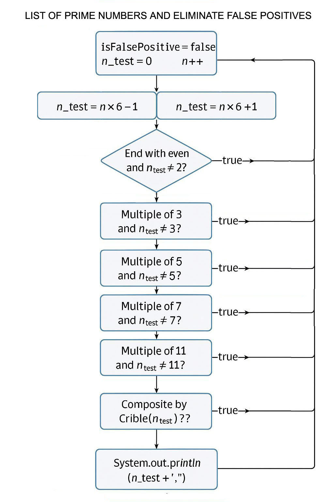
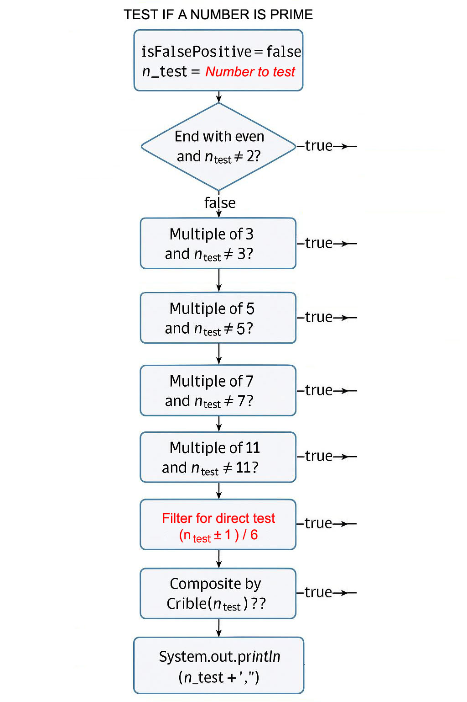

**GENERER UNE LISTE DE NOMBRES PREMIERS ET ELIMINATION DES FAUX POSITIFS**

&nbsp; 
Cette méthode ne propose rien de nouveau, elle s’appuie sur des principes bien connus (notamment les formes 6n - 1 et 6n + 1), associés à un système de filtrage permettant d’éliminer les faux positifs. Elle est organisée dans une optique d’optimisation du calcul.

**Objectif :**
Dresser une liste de nombres premiers à partir d’un nombre quelconque supérieur à 2, en filtrant les faux positifs. Il s’agit d’une méthode structurée, simple et optimisée, qui permet d’identifier les nombres premiers avec une fiabilité de 100 %, à condition de suivre rigoureusement toutes les étapes.

**Méthode utilisée :  Forme 6n ± 1** 
- Aucun nombre premier ne sera omis, car tous les nombres premiers supérieurs à 3 sont nécessairement de la forme 6n ± 1.  
- Cette méthode inclut donc tous les candidats potentiels, bien que certains soient des faux positifs à éliminer par filtrage.

&nbsp; 
**I - FILTRES UTILISES (ordre à respecter) :** 
Basé sur un filtrage progressif de l’ensemble des entiers pour exclure les faux positifs, dans un objectif d’optimisation des opérations (gain de temps).

**1. ✅ Élimination de tous les nombres pairs (sauf 2) :** 
Tous les nombres se terminant par 0, 2, 4, 6, 8 sont pairs, donc non premiers, sauf le 2 lui-même.  Cela concerne tous les multiples de 2 : 4, 6, 8, 10, 12, 14, etc. 
Observation :  
On ne conserve que les nombres impairs, c’est-à-dire ceux se terminant par 1, 3, 5, 7, 9.

**2. ✅ Élimination des multiples de 3 (sauf 3) :** 
Tout nombre dont la somme des chiffres est multiple de 3 (soit 3, 6, 9, 21, etc.) est lui-même divisible par 3, donc non premier.

Exemple : 6921 
6 + 9 + 2 + 1 = 18 → 1 + 8 = 9 → divisible par 3, donc non premier ❌ 
Remarque : Ce filtre s’applique quel que soit le nombre de chiffres.

**3 ✅ Élimination des multiples de 5 (sauf 5) :** 
Tous les nombres se terminant par 5 ou 0, à partir de 10, sont des multiples de 5 et donc non premiers, à l’exception du 5 lui-même. 
Observation : On conserve les impairs restants se terminant par : 1, 3, 7, 9, etc.

**4. ✅ Élimination des multiples de 7 (sauf 7 lui-même) :** 
Méthode soustractive par 2 :

Étapes :  
1. Prendre le dernier chiffre du nombre (chiffre des unités).  
2. Le multiplier par 2.  
3. Soustraire ce résultat au reste du nombre (sans le dernier chiffre).  
4. Répéter les étapes avec le nouveau nombre obtenu.  
5. Si le résultat final est un multiple de 7 (0, 7, 14, 21, etc. ou leurs opposés négatifs : -7, -14...), alors le nombre d’origine est divisible par 7.

Exemple : 69097  
- Dernier chiffre = 7 → 7 × 2 = 14  
→ 6909 - 14 = 6895  
- Dernier chiffre = 5 → 5 × 2 = 10  
→ 689 - 10 = 679  
- Dernier chiffre = 9 → 9 × 2 = 18  
→ 67 - 18 = 49 ✅  est un multiple de 7 (7 × 7), donc 69097 est divisible par 7 ✔️

Exemple : 49
- Dernier chiffre = 9 → 9 × 2 = 18  
→ 4 - 18 = -14 → également divisible par 7 ✔️

Autre exemple : 217
- Dernier chiffre = 7 → 7 × 2 = 14 
→ 21 - 14 = 7 → également divisible par 7 ✔️

**5. ✅ Élimination des multiples de 11 (sauf 11 lui-même) :** 
Méthode : somme alternée des chiffres (signes - et +). Un nombre est divisible par 11 si la somme alternée de ses chiffres, en appliquant alternativement - et +, donne un résultat égal à 0 ou à un multiple de 11 (positif ou négatif). Il faut toujours commencer par le signe négatif de gauche à droite. Cette règle permet d’identifier rapidement si un nombre est divisible par 11, sans division.

Exemple : 209  
→ 2 - 0 + 9 = 11 → ✔️ divisible par 11

Exemple : 1694  
→ 1 - 6 + 9 - 4 = 0 → ✔️ divisible par 11

Exemple : 49709
→ 4 - 9 + 7 - 0 + 9 = 11 → ✔️ divisible par 11
  
**6. ✅ Crible dynamique avec diviseurs ≤ √n (≥ 13) :** 
Après les filtres précédents (2, 3, 5, 7, 11), on applique un crible dynamique en testant la divisibilité du nombre par les petits nombres premiers ≥ 13, jusqu’à √n.
Ce n’est pas un crible d’Ératosthène ni un test probabiliste, mais une méthode de division d’essai optimisée, simple et fiable pour des nombres de taille modérée.

Objectifs :
- ✅ Éliminer tous les faux positifs restants.
- ✅ Ne manquer aucun nombre premier.

Efficacité :
- Rapide et efficace pour des entiers jusqu’à 10⁶ à 10⁷, voire jusqu’à ~10¹⁰ avec les filtres précédents.
- Pour tester un seul nombre, cela peut fonctionner jusqu’à 10¹², voire 10¹⁴ selon les cas.
- Au-delà de 10¹², les performances chutent fortement car √n devient trop grand → le nombre de divisions explose.

&nbsp; 
**II - ESTIMATION DES PERFORMANCES (1M à 10M) - Contexte :** 
En code JAVA : Le type long permet de stocker des entiers de : -9 223 372 036 854 775 808 à +9 223 372 036 854 775 807 (soit environ ±9.2 × 10¹⁸). Le crible dynamique fonctionne avec long jusqu’à 9 × 10¹⁸, mais le temps de calcul augmente fortement au-delà de 10⁹ à 10¹²

Génération de tous les nombres premiers de 1 000 000 à 10 000 000 (soit 9 millions de nombres à tester) avec les filtres + crible dynamique sur un ordinateur standard (Intel i5, 4 à 8 Go de RAM).

Étapes :  
- Filtres rapides (pair, %3, %5, %7, %11) → Éliminent environ 90 % des nombres très rapidement.
- Crible dynamique (division ≤ √n) → Appliqué uniquement aux ~10 % restants, soit ~900 000 cas.

Temps estimé par test complet (filtres + divisions) : 
- Environ 0.1 ms à 5 ms selon la taille de n et l’optimisation du code.
- 900 000 × 1 ms (en moyenne) = 900 000 ms = 900 sec ≈ 15 minutes
- Intervalle réaliste : 10 à 15 minutes sur un i5 pour balayer tout l’intervalle avec cette méthode.

Astuce d’optimisation Java avec multi-thread (CPU multicœurs), avec un processeur à 8 cœurs :
- Diviser la plage [1 000 000 → 10 000 000] en 8 sous-intervalles équitables.
- Lancer 8 threads parallèles, chacun chargé de tester les nombres premiers dans sa portion.
- Résultat attendu : jusqu’à 8× plus rapide dans l’idéal. En pratique, on atteint ≈ 6 à 7× de gain selon la gestion des threads et des ressources.

Bonnes pratiques :
- Utiliser des structures thread-safe pour collecter les résultats (ex : ConcurrentLinkedQueue, CopyOnWriteArrayList).
- Fusionner les résultats des 8 threads à la fin pour obtenir la liste finale de nombres premiers.
- Bien gérer la synchronisation et éviter les blocages (deadlocks) ou surcharge CPU.

&nbsp; 
**III - REMARQUE SUR LES FILTRES NON UTILISES (ex : 13, 17, 19, …) :** 
Ces filtres ne sont pas appliqués car ils n’apporteraient pas un gain de performance significatif.
- Leurs règles sont plus complexes ou moins intuitives.
- Leur fréquence de détection (multiples rencontrés) est relativement plus faible.
- Ils sont naturellement filtrés par le crible dynamique via les divisions jusqu’à √n.

Ils sont donc inutiles à appliquer en amont, car leur ajout :
- Ne réduit pas suffisamment la charge de calcul,
- Et ajoute une surcharge inutile au traitement.

➤ **Filtre des multiples de 13 (×4 + reste) - Méthode :**
1. Prendre le dernier chiffre du nombre.
2. Le multiplier par 4.
3. L’ajouter au reste du nombre (sans le dernier chiffre).
4. Répéter jusqu’à obtenir un multiple évident de 13 (13, 26, 39, …).

Exemples : 
Avec 143 : 3×4 = 12 → 14 + 12 = 26 ⇒ divisible par 13 ✔️ 

Avec 2197 : 7×4 = 28 → 219 + 28 = 247 
→ 7×4 = 28 → 24 + 28 = 52 ⇒ (52 = 26 × 2 ou 13× 4), alors 2197 est divisible par 13 ✔️ 
→ 2×4= 8 → 5 + 8 = 13 ⇒ (13 = 13 × 1), alors 2197 est divisible par 13 ✔️

Avec 7007 : 7×4 = 28 → 700 + 28 = 728  
→ 8×4 = 32 → 72 + 32 = 104  
→ 4×4 = 16 → 10 + 16 = 26 ⇒ (26 = 13 × 2), alors 7007 est divisible par 13 ✔️

➤ **Multiple de 17 (×5, méthode soustractive) - Principe :**
1. Prendre le dernier chiffre du nombre.  
2. Le multiplier par 5.  
3. Soustraire ce résultat au reste du nombre (sans le dernier chiffre).  
4. Répéter le processus avec le nouveau nombre obtenu.

Deux cas de succès :
- Si le résultat final est 0 (méthode 1), le nombre est divisible par 17. ✔️  
- Si le résultat atteint ±17, ±34, ±51, …, (méthode 2), le nombre est aussi divisible par 17. ✔️

Méthode 1 – Avec 21063 :  
→ 3×5 = 15 → 2106 − 15 = 2091  
→ 1×5 = 5 → 209 − 5 = 204  
→ 4×5 = 20 → 20 − 20 = 0 ⇒ divisible par 17 ✔️

Méthode 2 – Avec 21199 :  
→ 9×5 = 45 → 2119 − 45 = 2074  
→ 4×5 = 20 → 207 − 20 = 187  
→ 7×5 = 35 → 18 − 35 = −17 ⇒ Reste ≠ 0, mais -17 (17 x -1) est divisible par 17 ✔️

Conclusion :
- Résultat final = 0 → divisible par 17 ✔️  
- Résultat final = ±17, ±34, … → divisible par 17 ✔️

➤ **Multiple de 19 (×2, méthode additive) - Principe :**
1. Prendre le dernier chiffre du nombre.  
2. Le multiplier par 2.  
3. Ajouter ce résultat au reste du nombre (sans le dernier chiffre).  
4. Répéter jusqu’à obtenir un nombre facile à tester.
Si le résultat est un multiple de 19 (19, 38, 57, …), alors le nombre initial est divisible par 19.

Exemple 1 - 133 : 
→ 3×2 = 6 → 13 + 6 = 19 ⇒ divisible par 19 ✔️

Exemple 2 - 361 : 
→ 1×2 = 2 → 36 + 2 = 38 ⇒ divisible par 19 ✔️  
→ 8×2 = 16 → 3 + 16 = 19 ⇒ divisible par 19 ✔️

Exemple 3 – 110523 : 
→ 3×2 = 6 → 11052 + 6 = 11058  
→ 8×2 = 16 → 1105 + 16 = 1121  
→ 1×2 = 2 → 112 + 2 = 114  
→ 4×2 = 8 → 11 + 8 = 19 ⇒ divisible par 19 ✔️

- Si le résultat = 19, 38, 57, … ⇒ divisible ✔️  
- Cette méthode est rapide et fiable pour des vérifications manuelles ou algorithmiques.

&nbsp; 
**IV - TESTEZ SI UN NOMBRE EST PREMIER :** 
Veuillez noter une particularité pour le test d’un nombre premier dans le fichier (***Main_Prime_Number_Test.java***) :
Afin d’éviter des calculs inutiles pour des nombres qui ne peuvent mathématiquement pas être premiers et pour un gain de performance dans les tests directs (n±1)/6, un filtre a été ajouté.

✅ **Filtre de forme pour test direct (n±1)/6 :**
Utilisation : Uniquement dans les tests de primalité d’un nombre.
Principe : Tout nombre premier > 3 est de la forme 6k ± 1.
Méthode, pour un entier n > 3, on vérifie :
→ (n − 1)/6
→ (n + 1)/6

Si aucun des deux résultats n’est un entier, alors n ne peut pas être premier.
Sinon, il est potentiellement premier et doit être vérifié par le crible dynamique (diviseurs ≤ √n).

Exemple : n = 291167
  - (291167 − 1)/6 = 291166/6 = 48527.666 ❌
  - (291167 + 1)/6 = 291168/6 = 48528 ✅
  → Le test est validé ⇒ n peut être premier ou faux positif.

Si n passe ce filtre, alors il est potentiellement premier, ou bien un faux positif (ex : 119 ou 133). Il faut donc poursuivre la vérification avec le crible dynamique (diviseurs ≤ √n) pour confirmer ou infirmer sa primalité.

&nbsp; 
**V - MISE EN OEUVRE ET UTILISATION – Voir les fichiers :** 
GENERER UNE LISTE DE NOMBRES PREMIERS (entre un début et une fin donnée) ET ELIMINATION DES FAUX POSITIFS : ***Main_List_Of_Prime_Number.java***

TESTEZ SI UN NOMBRE EST PREMIER - TEST IF A NUMBER IS PRIME : ***Main_Prime_Number_Test.java***
Pour information avec Intel Core i5 -1135G7, le traitement de ce nombre peut prendre entre 2 à 10 secondes : 9223372036854775907 (Nombre premier).

&nbsp; 
**VI - INFORMATION – MATHEMATIQUE / INFORMATIQUE :** 
Pour des tests massifs ou très grand (cryptographie), on utilise BigInteger :
- Peut manipuler des entiers de taille arbitraire
- Mais devient très lent avec BigInteger.sqrt() et des divisions répétées

Pour des très grands nombres (≥ 10¹²), il est recommandé d’utiliser :
- Miller-Rabin (test probabiliste rapide et fiable pour la plupart des usages).
- En « BigInteger » ou des algos de type AKS, Baillie–PSW, etc. (plus complexes, mais déterministes). Pour ce type de nombres, il faut des algorithmes spécialisés et une infrastructure très puissante (comme GIMPS + GPU NVIDIA H100).

Limite de temps et complexité :
Par exemple pour traiter un nombre de 41 024 320 chiffres décimaux (M₁₃₆₂₇₉₈₄₁ = 2¹³⁶²⁷⁹⁸⁴¹ − 1). Le plus grand connu à ce jour et qui appartient à la famille des nombres premiers de Mersenne, de la forme Mₚ = 2ᵖ − 1, découvert par Luke Durant, le 21 octobre 2024, via le projet GIMPS (Great Internet Mersenne Prime Search), avec l'aide d’un GPU NVIDIA H100.
Un exploit mathématique et informatique et pour donner une idée : Pour imprimer ce nombre sur papier A4 avec police standard, il faudrait plus de 10 000 pages !

Tester un nombre avec plus de 40 millions de chiffres impliquerait de faire un crible avec tous les diviseurs possibles jusqu’à sa racine carrée. Ce qui représente environ 10²⁰⁶⁰¹⁵⁹ tests. C’est infiniment lent, même avec des supercalculateurs.

Mémoire & stockage : Le simple stockage d’un tel nombre dépasse les capacités standards d’un PC classique. Chaque opération avec BigInteger devient ultra-lourde.

Tests de primalité avancés requis :
- Pour des nombres aussi grands, on utilise des tests probabilistes comme Miller-Rabin ou des tests spécialisés comme Lucas–Lehmer (spécifique aux nombres de Mersenne).
- Ces algos sont beaucoup plus rapides pour ces cas extrêmes, mais ne garantissent pas à 100% la primalité (sauf certaines conditions).
- Division euclidienne, base de l’arithmétique, mais pas un test de primalité.

En complément - Ce que ce n’est pas, même si elle y ressemble parfois :
- Crible d'Ératosthène : Méthode pour générer tous les nombres premiers jusqu’à un certain n (élimine les multiples).
- Crible d’Atkin : Plus moderne et plus rapide qu'Ératosthène pour de très grands n.
- Crible quadratique / algébrique : Algorithmes avancés de factorisation, pas de simple test.
- Crible de Sundaram : Autre méthode de génération des petits nombres premiers.

 - - - - - - - - - - - - - - - - - - - - - - - - - - - - - - - - - - - - - - - - - - - - - - - -

<table>
  <tr>
    <td align="center">
      <b>LISTE DE NOMBRES PREMIERS</b>
    </td>
    <td align="center">
      <b>UN NOMBRE EST PREMIER</b>
    </td>
  </tr>
  <tr>
    <td align="center">
       
    </td>
    <td align="center">
       
    </td>
  </tr>
</table>
